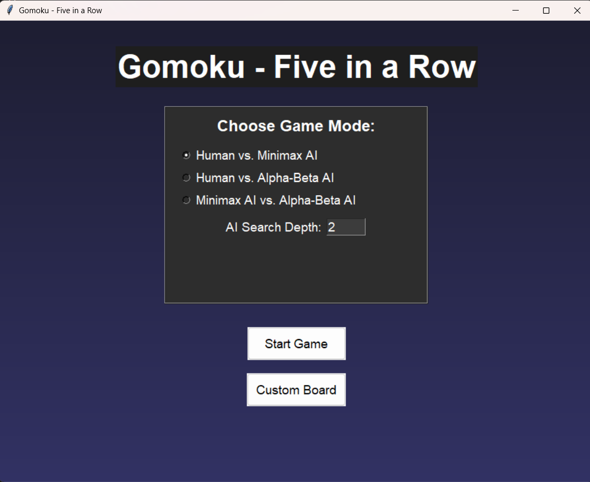
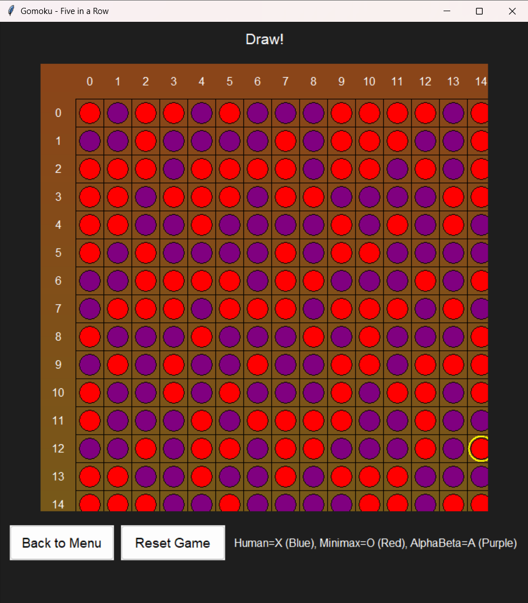

# Gomoku AI - Course Work Project 
**Faculty of Computers and Artificial Intelligence, Cairo University**  
*Artificial Intelligence Course Project*

[](https://www.python.org/)

A Gomoku (Five-in-a-Row) game implementation featuring AI opponents using Minimax and Alpha-Beta Pruning algorithms.

## 📖 Description
Gomoku is a strategy board game where players alternate placing stones trying to form an unbroken line of five. This project implements:
- **Human vs AI Mode**: Play against AI using Minimax algorithm
- **AI vs AI Mode**: Watch Minimax vs Alpha-Beta Pruning algorithms compete
- **Customizable Board**: Supports 15x15 or 19x19 boards (configurable)
- **Advanced Evaluation**: Pattern-based scoring system for strategic moves

## ✨ Features
- Dual gameplay modes (Human vs AI / AI vs AI)
- Graphical User Interface (GUI) using tkinter
- Minimax algorithm with configurable depth
- Alpha-Beta Pruning optimization
- Win detection with dynamic pattern checking
- Move validation and game state management

## 🎮 Usage

**Command Line Interface:**
```bash
python Gomoku.py
```

**Graphical Interface:**
```bash
python GUI.py
```

## 🗂️ Project Structure
### `Gomoku.py` (Core Engine)
```python
# Constants
BOARD_SIZE = 15       # Game board dimensions
WIN_COUNT = 5         # Required consecutive stones to win
MAX_DEPTH = 3         # Search depth for Minimax
PLAYER_SYMBOLS = {    # Board representation
    EMPTY: '·',
    HUMAN: 'X',
    AI_MINIMAX: 'O'
}

# Core Functions
create_board()        # Initialize game state
print_board()         # CLI display
check_win()           # Victory detection
minimax_decision()    # AI move selection
alpha_beta_search()   # Optimized AI moves
```

### `GUI.py` (Graphical Interface)
```python
# Pygame Configuration
WINDOW_SIZE = 800     # Display resolution
STONE_SIZE = 20       # Visual stone representation

# GUI Features
GomokuGUI class        # Manages game visualization
draw_board()           # Renders game state
handle_click()         # Processes player input
ai_move_thread()       # Non-blocking AI computation
```

## Screenshots



